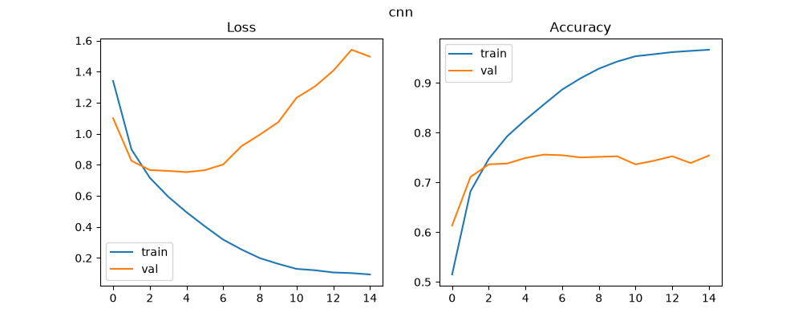
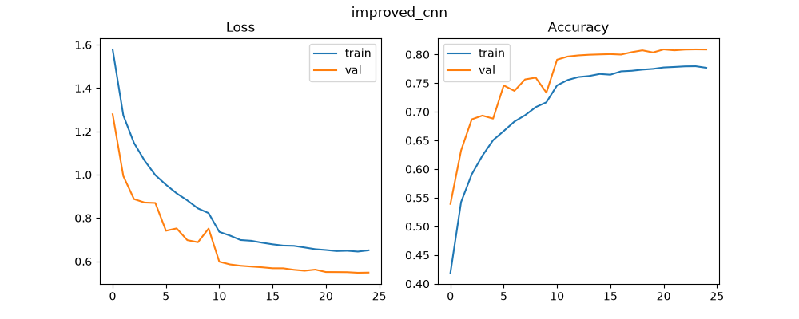
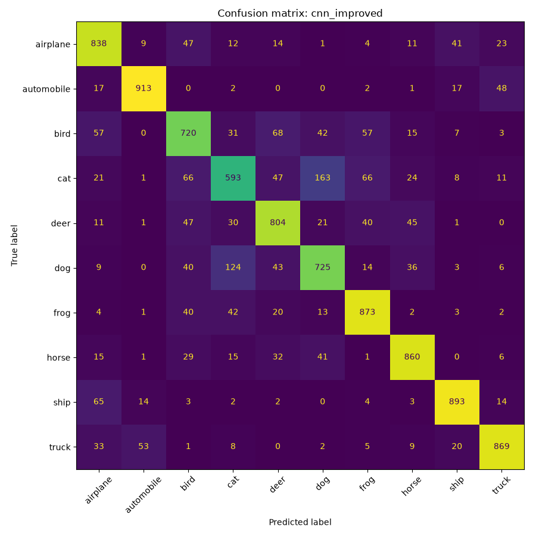

# CIFAR-10 Image Classifier

A CNN trained from scratch and a fine-tuned ResNet18 on CIFAR-10, built with PyTorch.

## Setup
```
pip install -r requirements.txt
```

## Usage
```
python src/train.py
python src/evaluate.py cnn_improved
python src/predict.py dog.jpg cnn_improved
```

Model names:

- `cnn` - Baseline CNN
- `cnn_improved` - With augmentation, batch normalization and dropout 
- `resnet` - Fine-tuned ResNet18

Training is configured by changing constants at the top of `train.py`

## Project structure
```
src/          model definitions, training, evaluation, prediction
notebooks/    dataset exploration
results/      training curves and confusion matrices
``` 

## Results

| Model | Test accuracy |
|-------|---------------|
| Baseline CNN | 75.6% |
| Improved CNN (augmentation, batch norm, dropout) | 80.9% |
| ResNet18 (fine-tuned) | 83.8% |

Improvements to the CNN consisted of adding augmentation, batch normalization and
dropout, which netted a 5.4 percentage point increase. Fine tuning the ResNet 
added another 2.9 percentage points, despite only training for 8 epochs. Since
it was pretrained the model only had to learn the 10 classes in CIFAR-10, since
general features were already encoded.



In the loss graph for the baseline the gap between the training and validation increased
with each epoch, a sign of overfitting.



Regularization narrowed the gap in the improved CNN.

## Confusion matrices



The diagonal entries represent the correct predictions while anything outside of them
is an incorrect prediction. The hardest to predict were the cats and dogs likely because
downscaling to 32x32 makes them very similar to each other and therefore very hard for
the models to differentiate between the two. The best performer was the automobile class
as it sat at 88 percent correct for the baseline CNN and went up to around 91 percent for 
both the improved CNN and ResNet.

For the CNN there were 147 dogs predicted as cats and 149 cats predicted as dogs. Upon adding
augmentation, batch normalization and dropout the Improved CNN decreased the amount of incorrect 
dog predictions as cats to 124. However the amount of cats predicted as dogs increased to 163. 
This means that the model was likely simply predicting dog more often which would make it more 
right in the dog case, however for the cats it would be more wrong.

The ResNet ended up predicting more dogs as cats went up to 156 while the cats predicted as 
dogs dropped to 108. For the baseline the error was at 296 between cats and dogs, the 
improved CNN was at 287 which was only around a 3 percent decrease. However the ResNet 
comes in at 264 which was a 10.8 percent decrease compared to the baseline CNN, which 
means that it actually separated the classes, rather than redistributing the errors like 
in the improved CNN. The pretrained features carry finer detail that couldn't be picked up
by the CNN on only 50,000 images.

Confusion matrices for the [baseline CNN](results/confusion_cnn.png) and [ResNet18](results/confusion_resnet.png) are also in the results folder.

Note: the CIFAR-10 test set was used for validation during training, so these
numbers are slightly optimistic.